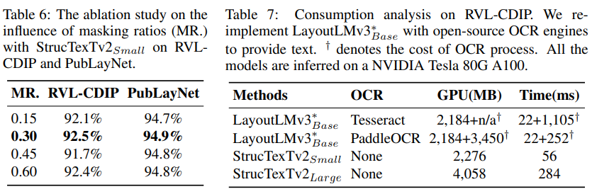

# ocr

## StrucTexTv2--2023

### 摘要

本文介绍了StrucTexTv2，一种通过执行遮盖式视觉-文本预测的有效文档图像预训练框架。它由两个自监督预训练任务组成：**基于文本区域级别的图像遮盖的遮盖式图像建模和遮盖式语言建模。所提出的方法随机遮盖一些图像区域，根据文本单词的边界框坐标。**我们的预训练任务的目标是同时重构遮盖图像区域的像素和相应的遮盖令牌。因此，预训练的编码器可以比通常预测遮盖图像补丁的遮盖式图像建模方法更好地捕捉文本语义。与依赖图像和文本模态的文档图像理解的遮盖式多模态建模方法相比，StrucTexTv2仅对图像进行建模，潜在地处理更多无需OCR预处理的应用场景。在文档图像理解的主流基准测试上进行的广泛实验表明，StrucTexTv2的有效性。**它在各种下游任务中实现了有竞争力甚至是新的最先进性能，如图像分类、布局分析、表结构识别、文档OCR和端到端场景下的信息提取。**

### 简介

在《人工智能文档》中，如何理解视觉丰富的文档图像并从中提取结构化信息已逐渐成为一个流行的研究课题。其主要相关任务包括文档图像分类（Harley等，2015）、布局分析（Zhong等，2019）、表格理解（Jaume等，2019）、文档OCR（也称文本识别）（Li等，2017；Liao等，2021）和端到端信息提取（通常由OCR和实体标注短语组成）（Wang等，2021）等。要很好地解决这些任务，有必要充分利用视觉和文本提示。同时，大规模自监督预训练（Li等，2021a；Appalaraju等，2021；Xu等，2020；2021；Huang等，2022；Gu等，2021）是一种最近兴起的技术，用于增强文档图像的多模态知识学习。

有两种主流的文档图像自监督预训练框架。如图1所示：**(a) 第一类是掩码多模态建模**，如所提出的预训练任务：MLM Devlin等人（2019）、MVLM Xu等人（2021）、MM-MLM Appalaraju等人（2021）和MSM Gu等人（2021），其输入主要包括OCR提取的文本和图像嵌入。这些方法从文本和图像中收集语义信息，严重依赖于前端OCR引擎并带有一定的计算成本。此外，OCR引擎和文档理解模块的两个组件是分别优化的，很难确保整个系统的性能。**(b) 第二类是掩码图像建模(MIM)**，它继承了基于视觉的自监督学习的概念，如BEiT Bao等人（2022）、SimMIM Xie等人（2022）、MAE He等人（2022）、CAE Chen等人（2022）和DiT Li等人（2022）等。MIM是一种强大的仅适用于图像的预训练技术，用于学习文档图像的视觉上下文表示。由于对文本内容的考虑不足，MIM通常适用于一些以视觉为主导的任务，如图像分类、布局分析和表格检测 Li等人（2022）。**(c) 为了充分利用MIM基础上的多模态知识，我们提出了第三种预训练框架，通过仅使用图像输入来学习视觉-文本表示，以端到端的方式优化文档图像理解任务的性能。**

由于视觉和语言之间存在巨大的差异，现有的文档理解方法要么考虑单一的模态，要么引入OCR引擎提前捕捉文本内容。研究人员使用文本令牌作为语言建模的输入，或选择固定大小的图像块作为视觉预训练任务的粒度。然而，文本内容在文档中是视觉上被定位并从图像中提取的。因此，我们提出了与文档内容相对应的**文本区域级别图像遮盖方案**，**以通过共享表示将视觉建模与语言建模连接起来。**

我们工作的主要贡献可以总结如下：

- **我们提出了一种新颖的自监督预训练框架，名为StrucTexTv2，通过对文档图像进行文本区域级别的遮盖来学习端到端的视觉-文本表示。**
- **在五个下游任务中表现优异的结果，证明了StrucTexTv2预训练模型在文档图像理解方面的有效性。**

### 相关工作

**自监督学习**在过去几年中得到了快速发展，得益于自监督任务和Transformer架构的发展，计算机视觉（CV）和自然语言处理（NLP）领域在从大规模无标签数据中进行知识学习方面取得了突破。在NLP领域，由于其高效和有效性，遮盖语言建模（MLM）任务已经被广泛应用于预训练模型（Devlin等，2019; Radford等，2018）。MLM任务会随机遮盖输入的一组文本标记，并根据周围的上下文重建它们。在CV领域，采用类似的想法，遮盖图像建模（MIM）也已经被成功验证。MIM有几个变体，例如，BEiT Bao等人（2022）和CAE Chen等人（2022）随机遮盖一定比例的图像补丁，并预测dVAE Ramesh等人（2021）学习的离散图像补丁标记。MAE He等人（2022）和SimMIM Xie等人（2022）采用更简单的方法，通过直接回归预测原始像素的RGB值。

由上述内容可知，**当前先进的文档预训练模型可以大致分为两类：多模态建模和图像建模方法**。前者的代表作品有LayoutLM系列、Docformer、UDoc和StrucTexT等，它们通常**依赖成熟的OCR引擎从文档图像中提取文本内容，并将其与图像嵌入一起输入编码器**。这些基于OCR的方法在某些以视觉为主导的任务上具有优异的性能，但是解决起来很繁琐。后者方法，如DiT，几乎遵循BEiT的思路，**直接在大规模文档图像数据上使用通用的CV预训练框架进行学习**。由于缺乏对文本信息的指导，该模型可能在语义理解方面存在不足。最近，还研究了适应预训练视觉语言模型的提示学习。这些基于提示的方法直接从文档中生成文本输出，并在下游任务上取得了竞争性能。

**本文提出的 StrucTexTv2 是一种全新的解决方案，以端到端的方式集成了 CV 和 NLP 的预训练方法的优点。由于编码器只接受图像输入，相比基于 OCR 的预训练模型，我们的框架可以避免 OCR 结果的干扰。在我们的预训练过程中，虽然监督标签部分来自 OCR 结果，但只有 OCR 结果中高置信度的单词被随机选择。OCR 质量对我们的预训练模型的影响在一定程度上得到了缓解。**

### 方法

####  MODEL ARCHITECTURE

如图2所示，StrucTexTv2有两个主要组件：**使用FPN集成视觉特征和语义特征的编码器网络以及包含两个目标的预训练框架：掩蔽语言建模和掩蔽图像建模。**

所提出的编码器由一个视觉提取器（CNN）和一个语义模块（Transformer）组成。给定一个输入文档图像，StrucTexTv2通过这个骨干网络提取视觉文本表示。具体来说，**从视觉提取器中提取CNN的最后四个下采样阶段的特征**。在语义模块中，遵循ViT Dosovitskiy等人（2021）处理2D特征映射的方法，将CNN的最后一阶段的特征以补丁级别平铺，**线性投影以获得补丁令牌嵌入的1D序列，它也作为Transformer的有效输入**。加上表示令牌索引的相对位置嵌入到令牌嵌入中。然后，标准Transformer接收输入令牌嵌入并输出语义增强特征。我们将输出特征重塑回到2D视觉空间中的上下文特征映射，并以8的因数上采样特征映射。我们采用FPN策略Lin等人（2017）来合并来自CNN的不同分辨率的视觉特征，然后将上下文特征映射与它们进行连接，得到一个大小为输入图像1/4的特征映射。

最后，介绍了一个融合网络，它由两个连续的1×1卷积层组成，进行更进一步的多模态融合。

#### PRE-TRAINING

为了增强StrucTexTv2对文档图像的理解能力，我们在大规模文档数据集IIT-CDIP Test Collection 1.0上进行预训练(Lewis et al. (2006))。与MAE(He et al. (2022))、BEiT(Bao et al. (2022))和DIT(Li et al. (2022))不同，我们不使用补丁级遮蔽策略进行预训练。相反，我们采用了一种新颖的**文本区域级遮蔽策略**，并采用了两个自监督预训练任务来学习视觉文本表示。随后的实验结果表明，**细粒度的文本区域级遮蔽策略比粗粒度的补丁级遮蔽策略更适用于文档理解。**

#####  TASK #1: MASKED LANGUAGE MODELING

为了鼓励模型学习上下文表示，类似于BERT Devlin et al. (2019)，我们随机用RGB值[255, 255, 255]屏蔽输入文档的一部分文本区域。我们在实验中发现30%的遮蔽率是最佳选择。根据文档中未遮蔽区域的上下文信息，编码器-解码器架构学习预测遮蔽文本区域的文本标记（在预定义的词汇表中）的索引，使用交叉熵损失。为避免WordPiece Song et al. (2021)产生的子词干扰，我们仅选择每个单词中的第一个子词，以保持文档图像中的单词数不变。需要注意的是，StrucTexTv2中的遮蔽语言建模任务不需要文本输入，这在NLP领域是必要的。

任务#1的解码器。 对于掩码语言建模，我们采用了一个极其简单的2层MLP作为解码器，将编码特征投影出来。每个文本区域的多模态特征从融合的特征图F_fuse中通过ROI-Align Ren et al. (2017)提取，计算如下：

其中 `b_i` 表示第 i 个文本区域的边界框，`P_{mlm,i}`通过交叉熵损失与 30,522 个标记类别进行优化。

#####  TASK #2: MASKED IMAGE MODELING

在 MAE He 等人 (2022)、BEiT Bao 等人 (2022) 和 SimMIM Xie 等人 (2022) 的工作中，基于 patch 的 Masked Image Modeling 在表示学习方面表现出了强大的潜力。然而，在文档理解领域，patch 级别的特征学习太过粗糙，无法表示文本或单词区域的细节。因此，我们引入了一种名为 Masked Image Modeling 的文本区域级别的视觉表示学习任务，以增强文档的表示和理解。与 LayoutLMv3 和 BEiT 等基于分词的分类不同，我们使用均方误差损失回归缺失像素的 RGB 值，从而显著提高了表示学习的性能。具体来说，我们对矩形文本区域进行掩蔽，预测缺失像素的 RGB 值。

**Decoder for Task #2**. 我们设计了一个使用Transpose Convolution进行全卷积的网络来实现遮挡文本区域的文档图像重建。具体而言，我们对每个文本区域的特征进行全局平均池化，生成表示每个遮挡文本区域的视觉“风格”的嵌入式向量`Emb_style`。为了增强其文本信息，我们使用一个嵌入层将MLM预测`P_{mlm,i}`编码为`Emb_content`，表示“内容”知识。最后，我们将`Emb_style`和`Emb_content`连接起来，并将其馈送到FCN中，生成最终的重建图像预测`P_{mim,i}` 。Mask Image Modeling的过程可以表示为：

其中，GAP是全局平均池化操作符。在MIM中，我们遵循MAE的方法来预测被遮盖的文本区域中缺失的像素。例如，我们将每个遮盖的文本区域的空间分辨率调整为固定的64×64，每个文本区域的回归目标是12,288个像素（64×64×3个RGB值）。在预训练阶段，`P_{mim,i}`通过MSE损失进行优化。

#### DOWNSTREAM TASKS

StrucTexTv2的预训练方案为图像输入提供了视觉-文本表示。这种多模态表示可以用于模型微调，并且对许多下游任务都有好处。

**任务 #1：文档图像分类**

文档图像分类旨在预测每个文档图像的类别，这是办公自动化中的基本任务之一。对于此任务，我们通过四个3x3的带有步幅2的卷积层降采样骨干网络的输出特征图。接下来，将图像表示传入最终的线性层，使用softmax预测类别标签。

**任务 #2：文档版面分析**

文档版面分析旨在通过目标检测来识别文档图像的版面组成部分。我们采用Cascade R-CNN（Cai和Vasconcelos，2018）作为检测框架来执行布局元素检测，并将其骨干网络替换为StrucTexTv2。由于骨干网络的多尺度上下文设计，FPN融合层的四个分辨率修改特征（P2∼P5）被送入检测器的迭代结构头部。

**任务 #3：表格结构识别**

表格结构识别旨在识别表格的内部结构，这对于文档理解至关重要。具体来说，我们在表格结构识别框架中采用 Cascade R-CNN 进行单元格检测，同时将特征编码器替换为骨干网络。由于一些表格图像是通过摄像头收集的，并且许多单元格是畸变的，因此我们修改了 Cascade R-CNN 的最终输出，以将其变为单元格四个顶点的坐标回归。

**任务  #4: 文档OCR** 

我们采用StrucTexTv2模型进行端到端的文档OCR（光学字符识别）。我们的OCR方法包括单词级别的文本检测和识别模块。它们共享骨干网络的特征，并通过ROI-Align操作连接。文本检测模块采用标准的DB算法（Liao等人，2023），用于预测单词级别边界框的二值化掩膜。类似于NRTR（Sheng等人，2019），文本识别模块由多层Transformer解码器组成，用于预测每个单词的字符序列。

**任务  #5: end to end 信息抽取**

该任务的目标是从给定文档中提取关键字段的实体级内容，而不需要预定义的OCR信息。我们基于文档OCR的架构评估StrucTexTv2模型，并为语义实体抽取设计了一个新分支。具体而言，我们开发了另一个DB检测器来识别实体边界框。通过ROI特征执行额外的MLP块，以分类实体标签。这些边界框用于单词分组，以合并任务#4中的文本内容。最终，通过按阅读顺序对单词进行分组，获得关键信息。

### 实验

#### 数据集

**预训练数据集：** 按照 DiT Li 等人 (2022) 的方法，我们在 IIT-CDIP Test Collection 1.0 数据集上对 StrucTexTv2 进行了预训练。该数据集包含 1100 万个多页文档，被拆分成单页，共 4200 万个文档图像。

**文档分类数据集： RVL-CDIP** Harley 等人 (2015) 数据集包含 16 个类别的 40 万个灰度文档图像，每个类别有 2.5 万个图像。我们采用 RVL-CDIP 数据集作为文档分类任务的基准，使用平均分类准确率评估模型性能。

**文档布局分析数据集： PubLayNet** Zhong 等人 (2019) 数据集包含超过 36 万张纸质图像，是通过自动解析 PubMed XML 文件构建的。五个典型的文档布局元素（文本、标题、列表、图片和表格）用边界框进行注释。我们使用交并比（IOU）下的平均精度（mAP）作为文档布局分析的评估指标。

**表格结构识别数据集： WTW** Long 等人 (2021) 数据集包含自然场景中的非约束表格，要求表格结构识别器具有判别和生成能力。该数据集共有 14581 张图像，涵盖了各种真实的商业场景，并提供了相应的表格完整注释（包括单元格坐标和行列信息）。

**文档 OCR 数据集： FUNSD** Jaume 等人 (2019) 是一个表单理解数据集，包含 199 个表单，用于提取表单中预定义的四个语义实体（问题、答案、标题和其他）及其链接。我们在 FUNSD 数据集上重点关注文档 OCR 和端到端信息提取的两个任务。为了评估，我们计算预测结果和基准答案之间的标准化 Levenshtein 相似度（1-NED）。

#### 具体措施

基于IIT-CDIP进行的预训练 我们提出的StrucTexTv2编码器网络主要由CNN和Transformer组成。为了平衡效率和效果，StrucTexTv2Small采用ResNet-50和12层Transformer（128个隐藏单元和8个注意力头），仅引入了28M的参数。较大版本的StrucTexTv2Large采用ResNeXt-101 Xie等人（2017）和24层Transformer（768个隐藏单元和8个注意力头），总参数量为238M。我们使用在ImageNet上训练的网络作为CNN的初始化。Transformer从语言模型Sun等人（2020）中初始化。StrucTexTv2Small和StrucTexTv2Large分别需要17小时和52小时来训练一个IIT-CDIP数据集的epoch。整个预训练阶段需要32个Nvidia Tesla 80G A100 GPU，耗时近一周。

在RVL-CDIP上进行微调 我们评估了StrucTexTv2在文档图像分类任务上的表现。我们将模型在RVL-CDIP上微调20个epoch，使用交叉熵损失函数进行训练。学习率设置为3e-4，批量大小为28。输入图像被调整为960×960大小并保持其纵横比。我们在损失函数中使用标签平滑=0.1。此外，我们还在训练阶段应用了CutMix和MixUp等数据增强方法，概率为0.3。

在PubLayNet上进行微调 我们在PubLayNet的验证集上进行文档布局分析的评估。我们微调Cascade R-CNN，并使用预训练模型初始化backbone。检测器使用动量优化器进行8个epoch的训练，批量大小为8。学习率设置为1e-2，在第3个epoch时降至1e-3，在第6个epoch时降至1e-4。我们使用随机裁剪来增强训练图像，其中短边不超过800像素。

在WTW上进行微调，我们进行表格结构识别实验。我们还采用Cascade R-CNN来检测表格单元格，其主干网络由预训练的StrucTexTv2替换。我们使用ADAM Kingma & Ba（2015）优化器进行端到端微调，共进行20个epochs，批量大小为16，学习率为1e-4。在随机缩放后，输入图像的大小被调整为640×640，长边被调整为640个像素。

在FUNSD上进行微调，由于拥有完整的注释，文档OCR和端到端信息提取任务都在FUNSD上进行衡量。我们将文本识别网络设置为一个6层的Transformer，并对整个模型进行微调，共进行1200个epochs，批量大小为32。我们遵循余弦学习率策略，并将初始学习率设置为5e-4。额外的位置嵌入被附加到roi-features上，并传递给解码器的每个层。训练损失（除了DB检测器）使用交叉熵函数。此外，对于文本识别模块中的每个解码器层，估计相同的损失以获得更好的收敛训练。

#### 与最先进技术的比较

#### 消融研究

为了进一步检验 StrucTexTv2 的不同贡献，我们进行了多项消融实验，例如 PubLayNet 上的文档布局分析、RVLCDIP 上的文档图像分类和 FUNSD 上的端到端信息提取。 消融研究中的所有模型都经过 1 个 epoch 的预训练，仅从 IIT-CDIP 数据集中采样了 1M 个文档。

**编码结构**

在本研究中，我们通过用ViT Dosovitskiy等人（2021）和SwinTransformer Liu等人（2021）替换StrucTexTv2的骨干网络，评估了编码结构的影响。如表5所示，即使是提出的StrucTexTv2Small网络在RVL-CDIP和PubLayNet上也取得了更好的结果，分别为92.5％的准确度和94.9％的mAP。用ViTBase替换后，两个基准测试的性能下降了3.9％的准确度和1.7％的mAP。用SwinTransformerBase替换后，退化更加明显。此外，StrucTexTv2Large在RVL-CDIP上提高了1.6％的性能，在PubLayNet上提高了0.7％。

**预训练任务**

在本研究中，我们确定了不同预训练任务的贡献。如表5底部所示，仅MIM预训练模型在RVL-CDIP上实现了91.8％的准确度，在PubLayNet上实现了94.1％的mAP。仅MLM预训练模型为两个数据集分别实现了92.0％和94.5％。MLM和MIM可以共同利用StrucTexTv2中的多模态特征表示。通过结合提出的两种预训练任务，准确度在RVL-CDIP上提高到92.5％，mAP在PubLayNet上达到94.9％。

**掩码比率**

我们研究了使用不同掩码比率进行训练的影响。如表6所示，将掩码比率替换为0.15、0.30、0.45和0.60时，RVL-CDIP的准确率分别为92.1%、92.5%、91.7%和92.4%。我们还报告了在PubLayNet上的结果，PubLayNet的平均精度（mAP）分别为94.7%、94.9%、94.8%和94.8%。这表明，我们提出的预训练任务的最佳掩码比率为0.30。同时，它也表明，下游任务的性能对掩码比率的选择不太敏感。

**消耗分析**

如表7所示，StrucTexTv2Small在RVL-CDIP上消耗56ms和2,276MB的GPU内存来推断一张图像，而LayoutLMv3Base则在不同的OCR引擎下消耗更多的GPU内存或时间。观察到，两阶段方法的OCR过程占据了大部分计算开销。因此，我们的无OCR框架可以在性能和效率之间取得更好的平衡。

**掩码策略**

我们在表8中评估了将文本区域级别掩码调整为补丁级别掩码的影响。性能下降了4.2%的准确率得分和1.0%的PubLayNet的平均精度（mAP），这证明了所提出的文本区域掩码策略的有效性。

### 结论

这项工作成功地探索了一种名为 StrucTexTv2 的新型预训练框架，用于学习文档图像的视觉文本表示，并仅使用图像输入进行文档图像理解。通过基于文本区域的图像掩蔽，然后预测对应的视觉和文本内容，该提出的编码器可以有效地从大规模文档图像中受益。在五个文档理解任务上进行了广泛的实验，证明了 StrucTexTv2 相对于现有技术方法的优越性，尤其是在效率和有效性方面的提高。